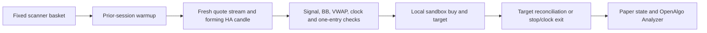

# September 25, 2026 scanner-basket backtest and paper forward test

The user requested today's session only using the existing strategy, then a paper
strategy on `http://127.0.0.1:5000`. Original application, Crypto, strategy engine,
historical database and previous results are preserved.

## Verified backtest

Open **http://127.0.0.1:8783** while the report server runs. Restart:

```powershell
.\.venv\Scripts\python.exe narasimha_pc_backtest/serve.py --output narasimha_pc_backtest/today_20260925/output --port 8783
```

The completed scanner pass had 2,660 valid quotes from 2,668 instruments. Selection
was frozen at **15:19:11 IST**: top 50 gainers and top 50 volume shockers (cumulative
volume / average of five previous completed daily volumes, strictly above 1).
There are **80 unique instruments**, including broker-classified EQ ETFs. This is
the scanner's all-EQ universe, not a manually curated list of ordinary shares.
The initially saved incomplete baseline-pass selection is retained as superseded.

Fresh FYERS one-minute candles include 30 calendar days of indicator warmup.
Only September 25 trades are evaluated. Candles were refreshed after 15:21, through
the non-F&O 15:20 square-off candle. The strategy engine and cost assumptions are
unchanged: HA1m, BB20x2, raw session VWAP, no-lower-wick signal and forming entry,
signal low minus Rs 0.10 stop, 3R target, Rs 100,000 per trade, one trade per stock
per day, 5 bps market slippage and 5 bps fees per fill.

| Basket | Selected | Eligible | Trades per path | Winners | Net P&L per path |
|---|---:|---:|---:|---:|---:|
| Volume shockers | 50 | 32 | 29 | 20 | Rs 75,093.32 |
| Top gainers | 50 | 45 | 42 | 32 | Rs 145,845.61 |
| Deduplicated union | 80 | 59 | 53 | 38 | **Rs 146,174.94** |

OLHC and OHLC happen to produce the same fills/P&L in this sample; their modeled
timestamps can differ. **Never add the two paths or the overlapping group totals.**
Union gross after slippage: Rs 151,543.00; fees: Rs 5,368.06; win rate: 71.70%;
profit factor: 5.446; peak simultaneous entry notional: Rs 2,496,614.35 across 25
positions. This is not margin required or a funded-account simulation.

Twenty-one instruments are excluded for missing minutes through square-off.
See `output/coverage.csv`; exclusions are not counted as zero-return trades.
All 106 saved trades passed the independent source/entry/accounting checks.
The original 16 engine tests passed. Seven paper tests cover forming entry,
VWAP/wicks, missing feed, bounded history, cancellation/fill races, sandbox routing,
session cleanup and a mutation proving the VWAP test catches a disabled guard.
Chrome report checks pass for both paths, trade charts, raw/HA toggle and mobile.

The first verifier attempt failed because today's exported Parquet omitted the
prior-day 19 HA closes needed to independently check opening signals.
`verify_today.py` includes the warmup context, checks all current-day indicators
against the original exports, and reruns the unchanged independent verifier.
It changes no ledger fills or strategy calculations.

**Interpretation:** afternoon winners were selected after morning entry times.
This is a retrospective basket test with selection bias, not a causal scanner
backtest. One profitable session does not overturn the earlier negative five-year
Nifty study. Single-session daily-close drawdown is zero and says nothing about
intraday drawdown. No annualized Sharpe/CAGR or QuantStats estimate is supplied
from a one-day returns series. Use paper forward observation, not live promotion.

## Paper package and intended schedule

Upload `narasimha_scanner_paper.py` in OpenAlgo's `/python` page. It imports the
local `paper_runtime.py`, frozen `selection.json` and existing indicator code.
Keep this folder in this workspace. It is a local Windows package, not a portable
single-file strategy.

- Name: `Narasimha HA1m Sep25 scanner basket PAPER`.
- Exchange NSE; Monday-Friday; start **09:00**, stop **15:25**, Asia/Kolkata.
- Exchange calendar controls eligible sessions. No immediate trading start.
- Both scanner groups remain included; no winning-stock optimization was done.
- Basket remains the frozen 80 instruments until explicitly changed. It does not
  silently replace them with tomorrow's winners or claim dynamic-scanner parity.
- Warmup must finish before 09:15. A late start skips the session because it cannot
  reconstruct an intraday live VWAP from unobserved ticks.
- Broker quotes feed observed one-minute candles. Feed gaps, late first quotes,
  backward volume and queue overflow disable further entries for affected stocks.
  Quotes are not guaranteed to reproduce exchange-complete tick candles.
- Entries and exits call **only the local sandbox service**, never a mode-dependent
  live order endpoint. This is intentionally tied to this OpenAlgo instance and DB.
- The sandbox target is a resting LIMIT. On observed target/stop/clock events,
  the runner reconciles/cancels the target before a replacement exit, preventing
  a second sell when the target fills during cancellation. A target replacement
  is a marketable limit at the same target; stop/clock exits are market orders.
- Sandbox fills, price improvement, charges and margin rules differ from the
  illustrative backtest model. Entry sizing leaves a 0.1% plus one-tick buffer
  under Rs 1 lakh; it is not a promise of the exact historical share quantity.
- State is durably written before order submission. An ambiguous/unfinished prior
  attempt prevents automatic restart; inspect Analyzer and reconcile that state.
  A Windows file lock prevents duplicate runners.
- Software stops and clock exits need the process, data connection and OpenAlgo
  services running. Abrupt termination can leave paper positions/targets to inspect.
  There is no live-trading flag or fallback path.

Resource review: SQLite snapshot uses explicit close; source DuckDB connections
are context-managed; SDK HTTP/WebSocket clients close in finally; sandbox sessions
are removed on both success and error. Quote queue is capped at 20,000, indicator
history at 20, and per-day state at the fixed 80-symbol basket. This was a static
review plus the exception-cleanup test, not a full market-day resource soak.

Actual activation status is recorded in the roadmap and `deployment.json` only
after a successful authenticated upload. `deployment_plan.json` alone is **not**
proof of upload. The report server is separate from the trading application.

## Reproduction and verification

`collect.py` freezes a completed scanner snapshot, downloads candles with the
existing broker login without printing secrets, and supports a current-day
refresh. `replay_today.py` refuses to overwrite its source DB/output. Preserve
this completed folder and use a separate copy/output arrangement for another run.

```powershell
.\.venv\Scripts\python.exe narasimha_pc_backtest/today_20260925/verify_today.py
.\.venv\Scripts\python.exe -m pytest narasimha_pc_backtest/today_20260925/test_paper.py --confcutdir=narasimha_pc_backtest -o addopts= -p no:cacheprovider -q
node narasimha_pc_backtest/today_20260925/check_report.cjs
.\.venv\Scripts\python.exe narasimha_pc_backtest/today_20260925/check_connection.py
```

`check_connection.py` reads the existing local API key without displaying it,
checks one history request and a short WebSocket subscription, and sends no orders.
A market-hours forward signal/fill test is still needed after deployment.


