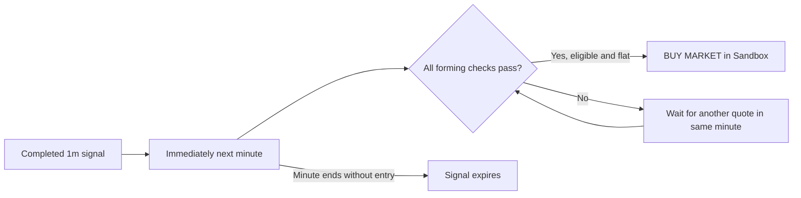
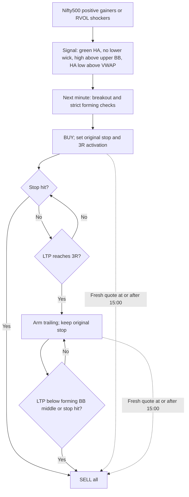
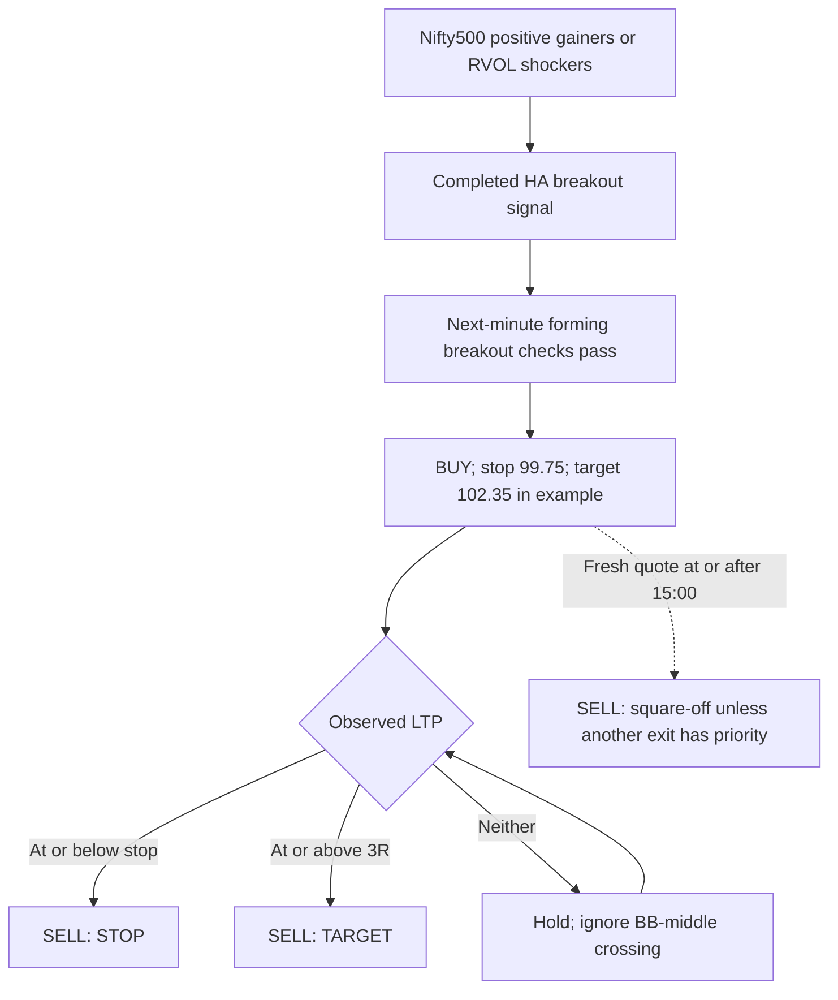
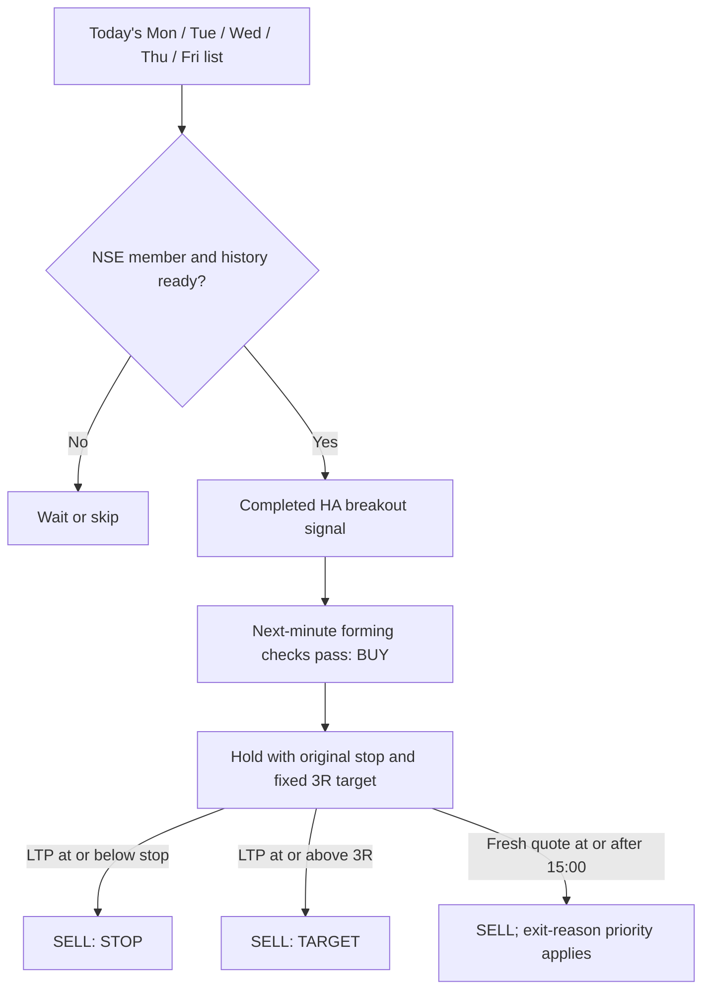
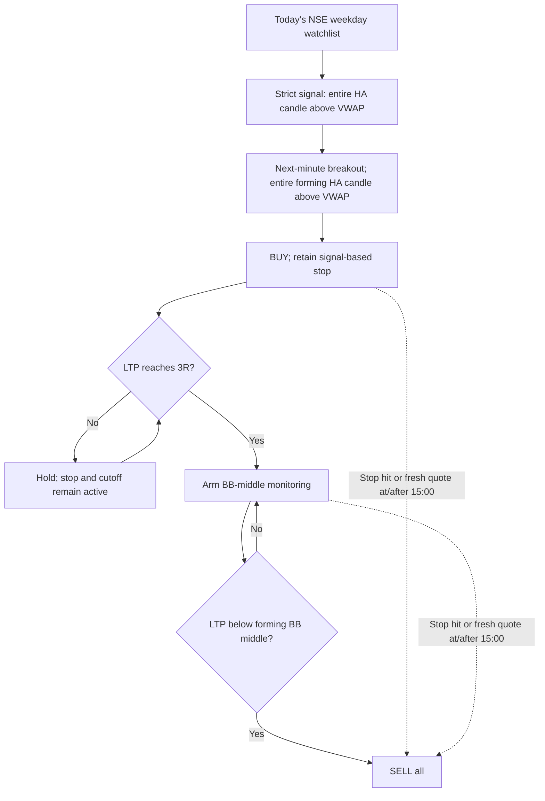

# Four strategies — signal, entry, exit and trailing charts

Source review: **30 September 2026**. This guide explains the current Python implementation.

**[Open the four interactive strategy charts](four-strategies-charts.html)** in a browser. Each strategy has its own chart, scenario selector, Play button and observation slider. The charts work offline. This Markdown file contains all the rules and separate flow diagrams; Mermaid-capable Markdown viewers render the diagrams.

The plotted prices and indicator levels are **illustrative teaching examples**, not market data, recalculated indicators from a complete candle history, backtest results or actual fills. The interactive charts demonstrate the decision rules; they do not connect to OpenAlgo or send orders. For recorded trade charts, use the existing [Strategy Reports page](http://127.0.0.1:5000/strategy-reports) when your app is running.

## 1. Compare the four strategies

| File | Stocks considered | VWAP requirement | What happens at 3R? |
|---|---|---|---|
| [Nifty500_Scanner_Trail_3R_10K.py](Nifty500_Scanner_Trail_3R_10K.py) | Dynamic Nifty500 gainers/shockers union | Entire signal and forming-entry HA candles above VWAP | Arm BB-middle exit; keep holding |
| [Top_Gain_Volumes_Live_1L_stategy.py](Top_Gain_Volumes_Live_1L_stategy.py) | Same dynamic Nifty500 union | Signal HA high and entry LTP above VWAP | Sell the full position |
| [Weekday_Watchlist_Fixed_3R_10K.py](Weekday_Watchlist_Fixed_3R_10K.py) | Today's named NSE watchlist | Signal HA high and entry LTP above VWAP | Sell the full position |
| [Weekday_Watchlist_Trail_3R_10K.py](Weekday_Watchlist_Trail_3R_10K.py) | Today's named NSE watchlist | Entire signal and forming-entry HA candles above VWAP | Arm BB-middle exit; keep holding |

**Common settings:** long-only; one-minute candles; ₹10,000 entry notional per trade; whole shares; Sandbox MARKET orders with MIS product; 09:15–15:00 IST scheduled session. The legacy `1L` filename does **not** mean ₹1 lakh in the current code.

These are two universes crossed with two rule sets. The trailing profiles change both the VWAP filter and the exit logic, so their entries need not match the fixed profiles.

## 2. Read the signal correctly

### Price and indicator definitions

**HA** means Heikin Ashi. For a raw one-minute candle with open `O`, high `H`, low `L`, close `C`:

```text
HA close = (O + H + L + C) / 4
HA open  = (previous HA open + previous HA close) / 2
HA high  = max(H, HA open, HA close)
HA low   = min(L, HA open, HA close)
```

The first seeded HA open is `(raw open + raw close) / 2`. Historical warmup supplies the prior HA state. HA prices describe the signal; actual orders fill at Sandbox execution prices.

**Bollinger Bands:** middle is the mean of 20 HA closes; upper is middle plus twice their **population** standard deviation. On a forming candle, the window uses the last 19 completed HA closes plus the current forming HA close. The lower band is not used for these decisions.

**VWAP:** calculated from raw candles, not HA candles:

```text
Raw typical price = (H + L + C) / 3
Session VWAP = sum(raw typical price × volume) / sum(volume)
```

Only the current session contributes to VWAP. During the entry minute, the forming raw typical price and volume observed so far contribute too. This is the implementation's candle-based VWAP, not a reconstruction of every exchange trade.

### Completed signal candle

All four require a completed one-minute candle with:

1. A full 20-close Bollinger window and positive candle volume.
2. Green HA body: `HA close > HA open`.
3. No lower HA wick: `HA low >= HA open - 1e-9`.
4. `HA high > BB upper`.
5. `HA high > VWAP`.

The trailing variants additionally require **`HA low > VWAP`**. Because HA low is the minimum of the HA candle's prices, this puts its entire OHLC above VWAP.

The condition is “above the upper band.” The code does not require the preceding candle to be below the band, nor does it require the signal close to be above the upper band.

### Entry in the immediately following minute

If 10:00:00–10:00:59 is the signal minute, entry is possible only during **10:01:00–10:01:59**. At each accepted Quote observation, all these checks must hold together:

| Check | Required condition |
|---|---|
| Breakout | `LTP > signal HA high` |
| Bollinger | `LTP > forming BB upper` |
| VWAP | `LTP > forming session VWAP` |
| Forming HA body | Green: `forming HA close > forming HA open` |
| Forming HA wick | No lower wick; observed raw low must be at least forming HA open, within tolerance |
| Volume | Positive forming candle volume |
| Extra trailing-profile filter | `forming HA low > forming VWAP` |
| Universe | Symbol still eligible at entry |
| Position and timing | No open position in that symbol for this strategy; signal unused; before 15:00 |
| Data readiness | Complete warmup, valid fresh quotes, connected/authenticated feed, no overflow |

**Entry happens on the first observed quote satisfying the complete set. It does not wait for the entry candle to close.** A later lower wick does not retrospectively cancel an already filled trade. If the following minute ends without entry, that signal expires; a later entry needs a new qualifying signal.



## 3. Stop, quantity and 3R — worked example

The current stop is **0.03% below signal HA low**, rounded **down** to the instrument tick. It is not ₹0.03 below the low and not 0.03% below entry.

```text
S = floor((signal HA low × 0.9997) / tick) × tick
E = confirmed Sandbox entry fill
R = E - S                         # price risk per share
T = ceil((E + 3 × R) / tick) × tick
```

The implementation adds tiny floating-point tolerances at the rounding boundaries. Fixed profiles use `T` as the exit trigger; trailing profiles use it as the activation trigger.

| Illustrative input/calculation | Value |
|---|---:|
| Signal HA open / high / low / close | ₹99.80 / ₹100.30 / ₹99.80 / ₹100.20 |
| Signal upper band / VWAP | ₹100.10 / ₹99.50 |
| Tick size | ₹0.05 |
| Low × 0.9997 | ₹99.77006 |
| Rounded stop `S` | **₹99.75** |
| Entry LTP, ask and assumed confirmed fill `E` | **₹100.40** |
| Risk per share `R` | **₹0.65** |
| 3R level `T` | **₹102.35** |
| Whole shares, floor(₹10,000 / ₹100.40) | **99** |
| Entry notional | **₹9,939.60** |
| Nominal stop distance × quantity | **₹64.35** |
| Gross gain if filled exactly at ₹102.35 | **₹193.05** |

**Sizing detail:** the shared helper first checks feasibility using a buy estimate with 5 bps adverse slippage and tick rounding. For forward execution, `SandboxExecution.enter()` then sizes with `floor(10000 / max(LTP, ask))`, treating a missing ask as zero, and recalculates 3R from the confirmed fill. Do not describe the helper's synthetic fill or fee estimate as the recorded Sandbox fill. Actual Sandbox reports use confirmed fills and zero booked fees; brokerage and taxes are excluded.

₹10,000 is a **per-entry notional budget**, not a loss budget or total portfolio cap. One open position per symbol per strategy is allowed. Fresh signals can re-enter after an exit; there is no one-trade-per-day rule. Multiple strategies can hold the same stock, and total exposure can exceed ₹10,000. Order acceptance still depends on Sandbox funds.

## 4. Strategy A — Nifty500 Scanner, trail after 3R

**File:** [Nifty500_Scanner_Trail_3R_10K.py](Nifty500_Scanner_Trail_3R_10K.py) · profile `nifty500_trailing` · [interactive chart A](four-strategies-charts.html#nifty500_trailing)

**Selection:** first restrict to the imported Nifty500 category. From fresh observations, take the union of the top 50 positive gainers by percentage change and top 50 positive volume shockers by RVOL. A shocker needs `RVOL > 1`, where RVOL is current cumulative volume divided by the mean volume of the previous five completed sessions. Positive means change versus previous close is greater than zero. A gainer does not separately need RVOL above 1. Overlaps appear once; the union has at most 100 symbols and can have fewer.

The runtime refreshes eligibility about every 0.25 seconds and checks it again at entry. A stock entering the basket must finish valid warmup. Leaving the basket blocks new entry but does not abandon an open position.

**Signal and entry:** use the common HA breakout rules plus **entire signal and forming-entry HA candles above VWAP**.

**Exit:** before 3R, retain the original stop and the 15:00 cutoff. At `LTP >= T`, activate trailing without selling. Once activated, sell at the first accepted observed `LTP < forming BB middle`. The original stop remains active throughout.



**Chart example:** buy ₹100.40 → reach ₹102.35 and arm → price rises to ₹103.20 → price falls to ₹102.40 while the middle band is ₹102.50 → exit. At an assumed ₹102.40 fill, gross P&L is `(102.40 - 100.40) × 99 = ₹198.00`. The stop stays ₹99.75 throughout.

## 5. Strategy B — Top Gain Volumes, fixed 3R

**File:** [Top_Gain_Volumes_Live_1L_stategy.py](Top_Gain_Volumes_Live_1L_stategy.py) · profile `nifty500_fixed` · [interactive chart B](four-strategies-charts.html#nifty500_fixed)

**Selection:** the same dynamic Nifty500 top-gainer/volume-shocker union described in Strategy A.

**Signal:** completed green HA candle, no lower wick, HA high above upper BB and VWAP. Its HA low may be at or below VWAP.

**Entry:** next-minute LTP breaks above signal HA high, forming upper BB and VWAP while the forming HA candle is green with no lower wick. There is no additional whole-HA-candle-above-VWAP condition.

**Exit:** sell the full position on `LTP <= stop`, `LTP >= fixed 3R target`, or the fresh-quote square-off at/after 15:00. There is no BB-middle trailing exit in this profile.



**Chart example:** buy ₹100.40 → reach ₹102.35 → exit immediately. The later move to ₹103.20 is outside this trade. At an assumed ₹102.35 fill, gross P&L is ₹193.05. The legacy name contains `1L`, but this current strategy allocates ₹10,000 per entry.

## 6. Strategy C — Weekday Watchlist, fixed 3R

**File:** [Weekday_Watchlist_Fixed_3R_10K.py](Weekday_Watchlist_Fixed_3R_10K.py) · profile `weekday_fixed` · [interactive chart C](four-strategies-charts.html#weekday_fixed)

**Selection:** the authenticated user's exact weekday watchlist name: `Mon`, `Tue`, `Wed`, `Thu` or `Fri`, based on IST date. Only NSE items also available in the loaded instrument universe are considered. No top-50, positive-change or RVOL gate is added to watchlist membership. An empty list produces no candidates and does not fall back to the scanner.

The list is reread about every two seconds. New members need warmup; removal blocks entry but leaves existing positions managed. Watchlist Chg% sorting and min/max display controls do not change these strategy filters.

**Signal/entry:** the same original, less restrictive VWAP rule as Strategy B. **Exit:** fixed 3R, original stop or 15:00 fresh-quote square-off. No trailing.



**Chart example:** a qualifying stock in today's list buys at ₹100.40 and exits at the ₹102.35 trigger, assuming that fill. The price path is intentionally the same as Strategy B to show that the main difference here is stock selection. A watchlist stock can qualify even when absent from the scanner's top lists.

## 7. Strategy D — Weekday Watchlist, trail after 3R

**File:** [Weekday_Watchlist_Trail_3R_10K.py](Weekday_Watchlist_Trail_3R_10K.py) · profile `weekday_trailing` · [interactive chart D](four-strategies-charts.html#weekday_trailing)

**Selection:** today's exact weekday NSE watchlist, as in Strategy C; no scanner-ranking restriction.

**Signal/entry:** the stricter rule from Strategy A: completed signal and forming-entry **HA low must both be above their corresponding VWAP**, in addition to the common breakout checks.

**Exit:** reaching 3R activates BB-middle monitoring; it does not sell any quantity. Subsequently exit on the first accepted observed LTP below the forming BB middle. The original stop and session cutoff remain active.



**Chart example:** buy ₹100.40 → arm at ₹102.35 → hold at ₹103.20 → exit when ₹102.40 falls below middle ₹102.50. The same path as Strategy A demonstrates identical trade management after entry; the candidate universe differs.

## 8. What “trail after 3R” actually does

| Observation in the example | LTP | Forming BB middle | Fixed variants | Trailing variants |
|---|---:|---:|---|---|
| Entry | ₹100.40 | ₹99.95 | Open | Open; trail inactive |
| Price below middle before 3R, but above stop | ₹100.20 | ₹100.25 | Hold | Hold; trail still inactive |
| First reaches 3R | ₹102.35 | ₹100.90 | Exit at target trigger | Arm; keep full position |
| Further rise | ₹103.20 | ₹101.80 | Already closed | Hold |
| Pullback, still above middle | ₹102.75 | ₹102.20 | Already closed | Hold |
| Below middle | ₹102.40 | ₹102.50 | Already closed | Exit: `BB_MIDDLE` |

The stop line is **₹99.75 in every row**. The middle band updates with the forming HA close; it can move down as well as up. There is no highest-price ratchet, breakeven stop movement, partial profit booking, or locked-in 3R profit. Once armed, trailing remains armed even if price drops below 3R. A middle-band exit can realize less than 3R or a loss. Before arming, a middle-band crossing alone causes no exit.

The default live call uses `trail_on_close=False`: **LTP below the forming middle is enough; no candle-close wait is required**. Equality with the middle does not trigger this exit. A prior above-to-below crossover is not separately required. The function arms first and then checks the band on the same quote, so both can theoretically occur on one observation.

## 9. Exit execution and cases that matter

| Case | Current behavior |
|---|---|
| LTP equals signal high, upper BB or VWAP | Entry requires strictly greater, so this check fails |
| LTP equals stop | Stop exit triggers |
| LTP equals 3R | Fixed exit triggers; trailing arms |
| LTP equals BB middle after arming | Keep holding, unless stop/cutoff applies |
| Signal expires | No delayed entry from that signal |
| Signal has already been used | No reuse; re-entry needs a fresh qualifying signal after exit |
| Stock leaves basket/list with an open trade | Continue managing the position |
| Invalid/incomplete warmup or stale quotes | Do not enter from that data |
| Invalid candle tracker during an open trade | BB-middle exit has no valid middle; original stop/cutoff can still act on valid quotes |
| No fresh exit quote at cutoff | Position remains visibly unresolved; no invented close |

**Exit priority for a single quote:** `STOP` first, then `TARGET` for fixed variants, then `BB_MIDDLE` for armed trailing variants, then `SQUARE_OFF`. Thus a target/stop/band hit at 15:00 can carry that reason instead of `SQUARE_OFF`.

The runtime observes quotes and submits **full-quantity MARKET exits**. It does not install a separate standing stop or target order when buying. Trigger levels are not guaranteed fill prices: a gap through the stop can fill lower, and the confirmed target exit fill can differ from the trigger. The helper's synthetic target-fill clamp is not a guarantee for forward Sandbox execution.

The scheduled session ends at 15:00, with the runtime allowing a short exit grace up to about 15:00:03. Square-off still needs an accepted fresh quote and a confirmed order fill. Quote and last-trade timestamps must be no more than 15 seconds old. Queue overflow disables new entries; missing minutes, out-of-order data or a gap over 90 seconds invalidate the candle tracker. Do not interpret stale or missing observations as continuous exchange ticks.

Forward execution uses actual OpenAlgo **Sandbox** order IDs and confirmed fills, with no live broker orders. Positions net by account/symbol even though reports identify separate strategies. Existing same-day run records prevent an automatic restart from overwriting the run. Uncertain or unresolved orders require reconciliation.

## 10. Use the charts and trace the source

The offline companion has separate panels A–D. Choose a scenario, press **Play observations**, or drag the slider. Each panel shows observed LTP, illustrative forming upper/middle bands, VWAP, original stop, 3R level and the first entry/activation/exit events. A table below the plot records the revealed observations. Later market observations remain visible after a trade closes, but the trade stays closed; these examples do not simulate a second entry.

Scenarios show: rise then retrace; stop before 3R; below-middle before activation; giveback below 3R after activation; and 15:00 square-off. A separate HA candle illustration shows the green/no-lower-wick signal and the stricter VWAP comparison. Assumed fills equal observed LTP only to make the arithmetic easy to follow.

For actual stored candles and fills, open **Strategy Reports**, choose the strategy/report, scenario and trade, then inspect raw or HA candles with BB upper/middle and VWAP. The saved September 29 replays used the earlier **₹0.10 stop offset**; they are not evidence for the current 0.03% stop without a new replay.

| Source | What was checked |
|---|---|
| [profiles.py](top_gain_volumes/profiles.py) | Four profile mappings; Nifty500 category and exact weekday list selection |
| [runtime.py](top_gain_volumes/runtime.py) | `eligible_symbols`, `TickCandles._finish`, `TickCandles.tick`, `enter`, `exit_trade`, live orchestration |
| [sandbox_execution.py](top_gain_volumes/sandbox_execution.py) | Whole-share forward sizing, MARKET/MIS orders, confirmed fills and fees |
| [fast_math.py](top_gain_volumes/fast_math.py) | Population-standard-deviation Bollinger calculation |
| [market_scanner_service.py](../services/market_scanner_service.py) | Ranking defaults and RVOL/positive-change filters |
| [Existing operational guide](top_gain_volumes/README.md) | Schedules, reports and historical replay context |

This deliverable documents the strategies; it does not change their Python rules, schedules or execution state.
