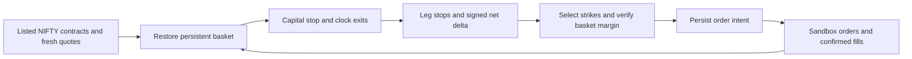

# Twelve NIFTY option paper strategies

Each launcher is a separate file in the parent `strategies/` folder:
`{iron_condor,delta,premium}_{intraday,positional}_{current,next}_week.py`.
They share this package and trade directly through OpenAlgo's Sandbox manager.
There is no live-order execution path or global mode switch.

## October 7 hedge update

All Delta and Premium variants now require both 200-point wings before new shorts
can be dispatched. Premium stops close the hit short and then its matching wing;
the surviving spread stays protected. Delta adjustments include hedge deltas under
the existing `all_legs` policy. Missing eligible wings skip new entries.

Carried positions retain their quantities, expiry, cycle and risk/P&L state.
On the next runner start, clock/price exits take priority; otherwise missing wings
are bought using fresh quotes before normal management continues. Hedge purchases
use the existing persisted intent journal and confirmed fills, including recovery
after a crash. A definitive rejection or stale recovery intent halts the strategy
and starts closing shorts before releasing any filled wing. Ambiguous orders stay
pending for reconciliation. Missing hedge contracts/quotes pause recovery while
clock/price risk checks continue; protection exists only after the purchases fill.

The saved config hash is unchanged: profile fields/policy values are unchanged,
and carried-state recovery explicitly handles the old unhedged baskets. The runner
never discards stored risk to make the new rules load. Previously saved backtest
results describe the former Delta/Premium rules; they were not recomputed.

## Confirmed rules

All initial entries are at 09:30 IST. Current/next refers to the nearest and
second listed expiry, including holiday adjustments. Existing positional baskets
retain their original expiry when adjusted. Quotes, lot size and expiry come
from the symbol master; historical symbols come from FYERS' expired catalogue.

| Family | Intraday entry | Positional entry | Leg stop | Adjustment |
|---|---|---|---|---|
| Delta | CE and PE near absolute delta 0.30 | Both premiums strictly 25 < price < 30 | None | Absolute signed net delta >= 0.50 |
| Premium | Both premiums nearest 50 | Both premiums strictly 25 < price < 30 | Entry * 1.30; close hit spread, retain other spread | None |
| Iron condor | CE nearest 50, PE matched absolute delta | CE in inclusive [9,11] nearest 10, PE matched delta | Either short entry * 4 closes all four; reselect | Absolute signed net delta >= 0.50 including hedges |

Condor PE exact delta ties choose the highest strike. **All twelve variants** buy
a CE at the short-call strike +200 and a PE at the short-put strike -200, using
the same expiry. Every leg has equal quantity. Open hedges first; cover shorts before
selling hedges. Rebalance by closing the whole old basket before opening a newly
selected basket; no overlapping old/new baskets within one strategy.

Each strategy receives ₹20,00,000 and a ₹20,000 loss threshold, including realized
losses from adjustments plus current mark-to-market. The threshold can be
exceeded by gaps, execution costs or delayed fills; it is not a guaranteed fill
price. It takes precedence over leg stops and re-entry. Intraday risk resets on
the next trading day. Positional losses/latch persist through that expiry cycle.

Intraday exits at 15:20. Positional baskets carry overnight and exit at expiry
15:20 (implementation default). Initial entries have a one-minute feed grace
ending 09:31; no late initial entries. Additional defaults in `policy.json`:
delta match tolerance 0.05, cooldown 60 seconds, re-entry cutoff 15:15.
Missing eligible strikes/hedges or invalid/stale prices cause a recorded skip.

## Capital and persistence

Sandbox capital was set to ₹5 crore without clearing pre-existing trades/P&L.
Automatic fund resets are disabled. `db/nifty_options/state.sqlite3` records
owner-scoped states, fills, intentions and events. A process lock prevents two
copies of one variant. Atomic revisions reject stale writes. A submitted order
is recovered by its unique tag, even when a crash precedes saving its order ID.
An ambiguous dispatch with no order record stops for reconciliation instead of
blindly duplicating it. Pending/partially opened baskets are retained and, after
a definitive opening failure, filled legs are unwound before any new entry.

Existing Sandbox aggregates identical instruments across strategies. This
package's own per-strategy fill ledger supplies attribution; it never closes all
positions at account level. Scheduled jobs need OpenAlgo and its quote proxy
running and a valid broker login. Stopping the app preserves state but prevents
stop monitoring until it resumes. Expired held contracts absent from the master
require reconciliation; the runner does not fabricate a settlement.

## Scheduling

Install the twelve parent launchers through the authenticated Python Strategies
upload page, preserving the existing schedules. Weekdays, NFO holiday calendar,
start 09:15 and stop 15:40. The early process start warms the quote stream; orders
wait for 09:30. The process stop allows exits initiated at 15:20 to finish, and
leaves NRML positional baskets persisted overnight. Do not directly overwrite
the JSON scheduler file while the running app owns it.

All twelve use the NRML product, including the intraday variants, whose own
runner closes at 15:20. This avoids the existing account-wide MIS square-off at
15:15 and keeps other strategies' settings unchanged. OpenAlgo must be running
for that managed exit. Broker margin requests use the same NRML product.

Installed October 3 with the user's authorized restart: 12 new plus eight
preserved schedules. An offline installer is available as
`python -m strategies.nifty_options.schedule --install-offline`; it refuses to
write while this project's `app.py` is running. Future edits should use the UI.

Check installation with `.venv/bin/python -m strategies.nifty_options.schedule`.
Check a launcher's configuration without orders with its `--check` flag.

## Historical replay — local files only

Latest requested scope is the last **three months**, replacing five years:

```sh
.venv/bin/python -m strategies.nifty_options.history --start 2026-07-03 --end 2026-10-01
.venv/bin/python -m strategies.nifty_options.replay --manifest backtest/nifty_options/2026-07-03_2026-10-01/manifest.json
```

The collector resumes completed gzip candle files and paces requests. The replay
must have complete downloaded catalogues for required expiries. Missing held
prices delay the basket until its next complete observed bar, with no invented
fill or equity mark. Each affected minute is recorded; more than five consecutive
missing minutes, or a missing final held mark, blocks completion. These gaps can
delay stops and understate drawdown. Invalid Greeks delay delta decisions, with
every affected held minute recorded; raw-price stops and clock exits continue.
Neither prices nor Greeks are replaced by fabricated values. FYERS login/data
service failures remain explicit in status JSON; temporary errors get bounded retries.

Greeks are **model-derived Black-76 estimates** from contemporaneous option
prices, a put-call parity forward and zero interest rate. Failed IV inversion
does not become a made-up delta. Option selection uses the prior completed
minute; execution uses the next open. Stops interpolate synchronized OLHC and
OHLC paths, include opening gaps and adverse fills; these are alternative modeled
paths, not actual ticks or guaranteed bounds. Re-entry waits for the next minute.
Positional trades open at the period end remain marked, never force-closed.
Replay monitors options through 15:30 before August 3, 2026, and 15:40 thereafter,
matching [NSE's derivatives session change](https://www.nseindia.com/static/products-services/closing-auction-session).
The index benchmark uses its available 09:15–15:29 minute closes. All weekday
sessions are checked against the saved exchange holiday calendar.

Historical margin model for all new hedged baskets reserves 200 points plus
3% spot notional plus hedge premiums. Legacy unhedged inputs retain the former
15%-of-spot-notional-per-short reserve. Both keep a
10% cash reserve. This is not reconstructed historical SPAN. Live paper sizing
uses FYERS basket margin with full-quantity verification and a 10% reserve.
Illustrative historical costs: ₹20 plus 0.1% turnover per fill and ₹0.05 adverse
slippage. These do not reconstruct every historical tax/brokerage slab. Sandbox
itself books no brokerage; its live paper ledger excludes fees.

Each path/variant exports trades, minute equity, final state and skipped entries.
Summary CSV/JSON/HTML, Plotly daily curves, OpenStatz offline dashboards and hashes
stay under `backtesting/` for new runs (October 5 destination update). VectorBT independently
reconciles every closed leg. NIFTY gross close return is the benchmark; drawdown
uses minute-end marks and can miss intraminute lows. No Reports database writes.

Scheduled sessions are separate: the twelve launchers now save daily Sandbox
reports to the existing `/reports` page, including startup, feed-waiting,
zero-entry and final states. They refresh every ten seconds and reconstruct
confirmed closed legs from the persistent journal on restart. Closed-leg P&L
is attributed to its realization date (full carried-trade profit, not daily
mark-to-market); open unrealized P&L and brokerage are excluded. Statistics
count legs rather than baskets, and capital metrics show premium turnover,
not broker margin. New entries remain gated on subscription readiness and
fresh prices. Partial/rejected subscriptions retry with pacing rather than
terminating the process. The 09:30–09:31 initial entry window is unchanged.

Existing accepted results and source archives under `backtest/` remain in place;
replay can still read that cache. New downloads, replay results and verification
artifacts use `backtesting/nifty_options/`. Do not import historical simulations
into the daily Reports database.



## Combined comparison dashboard

[Open the completed three-month dashboard](../../backtest/nifty_options/2026-07-03_2026-10-01/results/combined_dashboard.html).
The offline report combines all 12 strategies with cycle-level win rate, profit
factor, win/loss payoff, trade counts, return/drawdown charts, monthly P&L and
trade-cycle details. It switches between modeled paths without double-counting.
`reporting.build()` generates it for future runs. Rebuild from existing results
with `python -m strategies.nifty_options.dashboard <results-folder>`.
